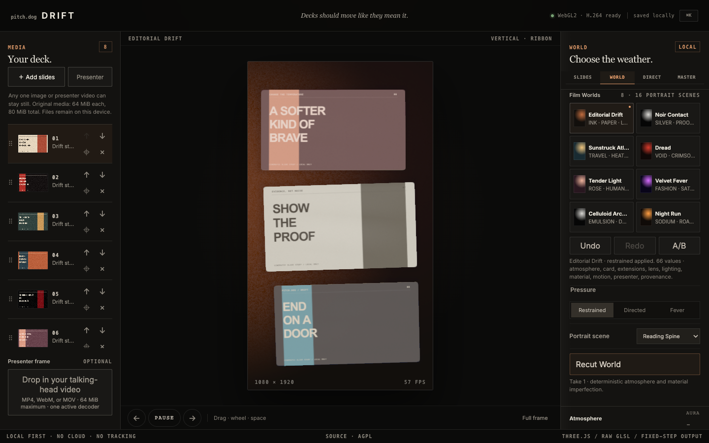

# Drift

**A local-first cinematic carousel studio for pitch decks.**

Drift turns still slides and one optional talking-head video into authored, Instagram-ready compositions. Three.js draws the scene, custom GLSL gives motion optical weight, and a fixed-step exporter renders frame `n` at exactly `n / fps`.



This is not a CSS carousel wearing a shader as jewellery. Preview and export share the same scene evaluator. Portable projects contain their source media. MP4 output is reopened, decoded, and checked before Drift calls it finished.

Drift is pre-1.0 and currently source-first. Read the [project status](docs/STATUS.md) for the exact boundary between public source, local candidates, verification, and release.

## V2 development boundary

The `codex/v2-directors-cut` branch contains the integrated V2 Director's Cut candidate. It combines Project V4, one canonical renderer/export path, eight authored Worlds, sixteen portrait scenes, forty live backgrounds, editorial timing, space, material, analytical light, global optics, tactile sound, and a directable pinned frame. It is a local development candidate, not a public release or a claim of owner creative approval.

V2 runs as `Drift V2 Dev.app` with a separate bundle identifier, WebKit store, cache, IndexedDB database, and sandbox. It deliberately does not own, open, or save real `.pitched` documents yet; use the installed V1 `Drift.app` for production projects. See the [current V2 status](docs/v2/CURRENT_STATUS.md), [requirement matrix](docs/v2/V2_REQUIREMENT_PHASE_MATRIX.md), and [donor ledger](docs/v2/DONOR_LEDGER.yaml).

```bash
npm run dev                  # browser V2 Dev on 127.0.0.1:4174
npm run build:v2-dev         # isolated Web build
npm run build:mac:v2-dev     # isolated Mac development app
npm run verify:mac:v2-dev    # bundle and packaged-WKWebView verification
```

The repository now contains two first-class ways to run the same studio:

- the original local browser application;
- a sandboxed, standalone macOS application in [`macos/`](macos/) with its native build and verification lanes in [`scripts/`](scripts/).

The native application keeps the WebGL renderer and project format intact. AppKit owns the window, menus, Finder integration, file permissions, staged destination writes, recovery, signing, and packaging. It does not invent a second renderer or a second export timeline.

## What Drift directs

- Horizontal and vertical infinite tracks with straight, arc, ribbon, cylinder, and tunnel paths.
- Drag, wheel, keyboard, autoplay, pause, reverse, inertia, and seamless-output lock.
- Custom stage, output, slide, and pinned-frame ratios.
- Cover/contain fit, focal point, scale, spacing, depth, tilt, velocity bend, continuous corners, borders, and shadows.
- Transparent, solid, gradient, aura, paper, and void backgrounds drawn in GLSL, with restrained world-only film grain.
- Eight authored V2 Worlds with three directing pressures, plus the preserved V1 theme library.
- One optional pinned image or presenter video, off by default.
- Independent pinned-frame size, X/Y position, safe inset, aspect, fit, focal point, matte, corners, border, shadow, timing, and track controls.
- Four cuts, six performances, four motion characters, four pose cadences, six handcrafted stacks, entry/exit direction, exact repeats, and editable tempo envelopes.
- Ten spatial paths, four material recipes, twelve light rigs, eight lens recipes, forty backgrounds, twenty palettes, and sixteen portrait-native scenes.
- Optional deterministic tactile sound from 23 local CC0 recordings, with three palettes, three grammars, and presenter-under-voice mixing.
- Deterministic H.264 MP4, transparent PNG still, and numbered PNG sequence output.
- Presenter audio at AAC-LC, 48 kHz stereo, with explicit priming, padding, and A/V-sync checks.
- IndexedDB autosave and portable `.pitched` project bundles with SHA-256 asset verification.
- Visible DOM fallback when WebGL2 is unavailable. It keeps media and project management usable while refusing to fake cinematic export.
- No analytics, cloud upload, remote font, runtime API, or hidden network request.

Moving-track media is deliberately image-only in v1. One pinned video keeps decoder load, export timing, and failure states legible.

## Run the browser studio

Requirements: Node.js 22.12 or newer. Current desktop Chrome is the verified complete browser-export path; Brave remains capability-gated.

```bash
npm ci
npm run dev
```

Then open the local URL Vite prints.

```bash
npm run check      # TypeScript, Vitest, source contracts, production build
npm run test:e2e   # Real-browser media, WebGL, fallback, and portability gauntlet
```

## Build the standalone Mac app

Requirements: macOS 13.3 or newer, Node.js 22.12 or newer, and Xcode command-line tools.

```bash
npm ci
npm run build:mac
open build/macos/Drift.app
```

The local build is a universal `arm64` + `x86_64` application with App Sandbox, hardened runtime, user-selected file access, and an ad-hoc signature. It does not need Node.js, Vite, Terminal, or a local server after it has been built.

Useful native commands:

```bash
npm run check:mac-source       # bridge, security, packaging, and codec invariants
npm run verify:mac             # bundle, manifest, signature, native and WebView probes
npm run package:mac:dmg        # local drag-to-Applications disk image
```

Read [the repository map](docs/REPOSITORY_MAP.md), [Mac architecture](docs/MACOS_APP.md), [user guide](docs/MACOS_USER_GUIDE.md), [product contract](docs/MACOS_PRODUCT_CONTRACT.md), [threat model](docs/MACOS_THREAT_MODEL.md), [QA gauntlet](docs/MACOS_QA.md), and [release boundary](docs/MACOS_RELEASE.md).

## Mac codec truth

The browser build and the standalone app deliberately use different AAC implementations.

### Browser build

The browser project uses `@mediabunny/aac-encoder`. That package provides a software AAC encoder backed by an FFmpeg-derived WebAssembly binary. Its licences and distribution obligations remain documented in [THIRD_PARTY_NOTICES.md](THIRD_PARTY_NOTICES.md).

### Standalone macOS build

The Mac build aliases that package to `src/lib/macosAacEncoder.ts`. This is not an empty shim. It registers a Mediabunny custom encoder that sends bounded PCM chunks through Drift’s typed native bridge to Apple’s software AAC-LC encoder in AudioToolbox.

The native receipt records and validates:

- AAC-LC / `mp4a.40.2`;
- 48 kHz stereo;
- 192 kbit/s target bitrate;
- AudioSpecificConfig and magic-cookie metadata;
- packet sizes and frame counts;
- leading priming frames;
- trailing padding frames;
- the exact equation `represented = leading + input + trailing`.

The Mac bundle therefore contains no FFmpeg runtime or codec WebAssembly. H.264 video still uses the encoder exposed by WKWebView. Presenter audio uses the bounded native AudioToolbox bridge. Either capability can fail visibly; audio is never stripped silently.

Presenter-audio masters remain limited to 24, 25, or 30 fps. Muted presenter video may use 50 or 60 fps.

## Export truth

The default master is 1080 × 1920, 30 fps, 8 seconds, SDR sRGB/Rec.709, opaque H.264 at 16 Mbit/s. Presenter audio, when enabled, is AAC-LC at 48 kHz stereo and 192 kbit/s.

- H.264 does not preserve alpha. Transparent masters use PNG stills or PNG sequences.
- PNG sequences stream to a chosen directory when the platform supports it. The ZIP fallback has a strict memory cap.
- File export writes through rollback-aware destinations. Cancelled work is aborted, removed, or explicitly neutralised instead of being presented as a valid master.
- MP4 completion includes container readback, dimensions, frame count, duration, timestamps, codec, colour, decoded probe frames, and presenter A/V timing checks.
- The macOS app stages file replacements on the destination volume and commits only after export and verification succeed.
- Existing PNG-sequence files are never overwritten.

The macOS runtime workflow separately falsifies four claims on an Apple Silicon runner:

1. WKWebView can create WebGL2 output and encode a real H.264 access unit.
2. AudioToolbox can create AAC-LC packets with coherent priming and padding metadata.
3. The actual deterministic exporter can render 90 fixed-step frames, mux an MP4, reopen it, and decode first/middle/final probe frames.
4. The same exporter can produce an alpha-capable PNG containing both visible and transparent pixels.

Those checks are evidence for the tested runtime, not a substitute for physical Intel testing, accessibility review, or long-form export QA.

## Runtime boundaries

| Runtime | Preview | MP4 | Presenter audio | Transparent PNG | Portable projects |
| --- | --- | --- | --- | --- | --- |
| Current desktop Chrome | Verified first class | Capability-tested AVC | Software AAC extension | Yes | Yes |
| Standalone Drift.app | Packaged WKWebView + WebGL2 | WKWebView AVC, capability-gated | Native AudioToolbox AAC bridge | Yes | Yes |
| Current desktop Brave | First-class browser target; not independently run in the frozen receipt | Capability-gated AVC | Software AAC extension where supported | Expected | Expected |
| Other WebGL2 browsers | Tested case by case | Capability-gated | Capability-gated | If canvas PNG is available | Yes |
| No WebGL2 | DOM media strip | Blocked visibly | Blocked | Blocked | Yes |

Drift ships no uploader, analytics client, or native network client. V2 tactile-sound recordings are committed locally and require no runtime fetch. The packaged app separately tests its page-level outbound lockdown; the signed network-client entitlement remains app-wide and is documented as a residual risk. The current portable archive cap is 96 MiB, with 80 MiB total source assets and 64 MiB per asset. Those limits prevent a friendly local tool from becoming a memory bomb.

## Why the Mac app is not an Electron bundle

The native shell is compiled directly from Swift using AppKit, WebKit, Foundation, Security, CryptoKit, Uniform Type Identifiers, and AudioToolbox. There is no Electron runtime, Chromium distribution, background server, updater daemon, shell bridge, or arbitrary native method invocation.

JavaScript receives opaque grants rather than absolute file paths. Native save and directory panels produce scoped capabilities. Writes are chunked, bounded, staged, synchronized, and either committed or rolled back. A document-start page boundary removes WebRTC constructors; HTTP, HTTPS, WebSocket, and FTP loads are blocked; remote downloads never receive destination authority. Deliberate help/source links open in the default browser. These are tested application controls, not a claim that arbitrary WebKit or macOS compromise is impossible.

## Binary release boundary

A local `.app` or CI-built DMG is not automatically a public release.

A distributable candidate still requires:

- Developer ID Application signing;
- hardened-runtime and App Sandbox entitlement readback;
- Apple notarization and stapling;
- Gatekeeper assessment;
- detached manifest and checksum verification;
- physical Apple Silicon and Intel user-journey testing;
- explicit authorization to publish.

The release workflow is manual and uploads text-only Actions evidence suitable for a public repository. It does not create a GitHub Release, push a tag, deploy a website, or publish binaries by itself.

## Design position

Drift studies the pacing, spatial confidence, and material restraint of excellent film and WebGL work without cloning anyone’s composition. Siena Film Foundation was an art-direction reference; Codrops’ WebGL carousel work was a technical conversation starter. The implementation and demo artwork here are original.

The default is authored on purpose. Controls can bend the scene, but presets are coherent parameter bundles rather than palette swaps. Distortion is bounded so a deck remains readable.

Slides are borderless by default. Five worlds rely on silhouette, spacing, and a shadow cast from the true rounded-card mask; Noir Contact alone uses a deliberate opaque 1 px keyline. Grain belongs to the surrounding world, never to imported artwork or presenter pixels. Its plate advances deterministically with output frames, runs at a quieter capped cadence in preview, and freezes under Pause or Reduce Motion.

## Contributing

Issues and pull requests are welcome. Start with [CONTRIBUTING.md](CONTRIBUTING.md), follow the [Code of Conduct](CODE_OF_CONDUCT.md), and never attach confidential deck material to a public report.

## Freedom, assets, and marks

Project-authored software and documentation are licensed under **GNU AGPL-3.0-or-later**. Original demo slides and synthetic test fixtures are **CC BY-SA 4.0**. Dependencies retain their own licences. See [ASSET-LICENSE.md](ASSET-LICENSE.md), [THIRD_PARTY_NOTICES.md](THIRD_PARTY_NOTICES.md), and [TRADEMARKS.md](TRADEMARKS.md).

Fork it. Study it. Change it. Share the changes. Do not use the pitch.dog marks to make a fork look official.
