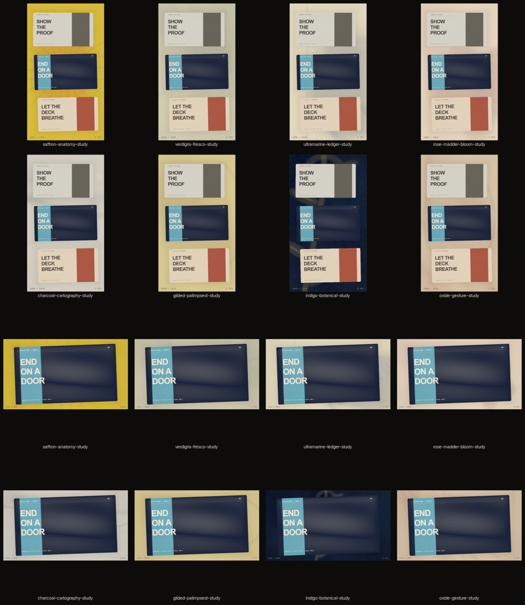

# Atelier backgrounds: design and verification

Date: 24 August 2026

Status: implemented and locally verified. Merge, exact-head CI, Mac packaging, installation, notarisation, publication, and owner approval are separate gates; this note does not collapse them.

## Outcome

Atelier is Drift's ninth structural background family: eight original living-pigment compositions designed to sit behind pitch-deck slides without becoming generic wallpaper. It expands the atlas to seventy-two studies and the palette library to twenty-eight.



| Study | Material grammar | Intended pressure |
| --- | --- | --- |
| Saffron Anatomy | Orange glaze, pooled edge, radial ink, marginal marks, sparse drips | Bright and authored |
| Verdigris Fresco | Mineral patina, plaster tooth, architectural arches, oxidised seam | Classical and quiet |
| Ultramarine Ledger | Off-axis blue pool, dry brush, editorial rules, ink margin | Structured and cool |
| Rose Madder Bloom | Five translucent lobes, pigment pool, fine veins, faded echo | Tender, never saccharine |
| Charcoal Cartography | Graphite rub, topographic contours, loose route gesture | Documentary and tactile |
| Gilded Palimpsest | Old-gold blocks, interrupted script, breathing calligraphic arc | Archival and warm |
| Indigo Botanical | Layered indigo glaze, stem, leaves, veins, faded-gold bloom | Dark and ceremonial |
| Oxide Gesture | Dry terracotta bands, broken orbit, sparse pigment runs | Abstract and earthen |

## Authorship and licence boundary

The visual spark was [Surya Mattu's account of asking Qwen to paint with code](https://surya.website/rling-qwen-to-paint-with-code). Its linked public p5.js sketches were inspected as visual references only. No sketch code, coordinates, palette samples, or reference artwork are included because public visibility is not a licence grant.

[p5.brush](https://github.com/acamposuribe/p5.brush) is a useful MIT-licensed open-source toolkit for watercolour, bleeding, hatching, and flow-field marks. Drift deliberately does not vendor it. Atelier is an original raw-GLSL implementation built for Drift's deterministic Three.js renderer and fixed-step exporter.

The reusable ideas are media ideas: transparent glazing, edge pooling, dry marks, paper tooth, sparse construction lines, negative space, and disciplined palettes. Those ideas are not a claim of ownership over watercolour, fresco, graphite, or generative painting.

## Technical contract

- One shader family; eight seed-addressed compositions; eight authored palettes.
- Aspect correction happens before every material gesture, so 9:16 and 16:9 recompose rather than crop.
- Motion uses only closed integer harmonics of the export phase. Frame zero and the loop endpoint are pixel-identical.
- The same shader, settings, seed, and explicit time drive preview, still, sequence, and MP4 output.
- Background motion remains between 0.04 and 0.14. Authored intensity never exceeds 0.55.
- Paper tooth is static. Drift's separate monochrome film-grain plate stays background-only and uses its existing deterministic held cadence.
- Transparent output remains an explicit bypass; applying an Atelier study returns the stage to opaque.
- The eight studies are available through the real searchable background browser. Saffron Anatomy and Verdigris Fresco also join the twelve-item hero shelf.

## Controls

Atelier uses the same direct controls as every other Drift atmosphere: composition, palette, variation, intensity, motion, grain, and vignette. Its authored defaults are intentionally restrained. A creator can push them, but the preset itself protects slide legibility.

## Repeatable gauntlet

```bash
npm run typecheck
npm test -- --run tests/backgrounds.test.ts tests/settingsValidation.test.ts tests/engineShader.test.ts tests/worldRegistry.test.ts
npx playwright test e2e/atelier-backgrounds.e2e.ts
npm run dev
npm run qa:atelier-atlas
```

The browser test renders every study at 9:16 and 16:9, rejects transparent or duplicate outputs, proves a small non-zero mid-loop pixel change, proves exact frame-zero/loop-end closure, and fails on shader or WebGL console errors. Its second journey reaches Atelier through the shipping V2 interface rather than calling an internal registry.

The atlas command captures the real WebGL canvas with bundled slides, writes all sixteen native-stage PNGs, records dimensions and SHA-256 hashes in `manifest.json`, produces `SHA256SUMS`, and assembles a labelled contact sheet under ignored `output/qa/atelier-backgrounds/<candidate>/`. The candidate name includes the commit plus a dirty-worktree fingerprint, so evidence from two uncommitted shader states cannot silently collide.

## Visual acceptance

The final local review used the actual slide scale, shadows, grain, and stage composition—not isolated shader swatches. It rejected the first pass because six studies disappeared behind normal slides. The accepted pass moved material events toward the periphery and strengthened their structure without turning up global spectacle.

What now holds:

- Saffron and Indigo provide the collection's two high-pressure poles.
- The six quieter studies remain distinguishable by material structure, not only colour.
- Critical gestures remain visible in the margins of both stage axes.
- Slide text and silhouette retain priority.
- No study introduces a translucent slide border or contaminates imported pixels with procedural grain.

Automated pixel checks prove determinism and bounded movement. The contact sheet proves inspectable output. Neither substitutes for the creator's final taste approval.
